<div align="center">
  

  <h1>Karı — Made Simple. Designed Secure.</h1>
  <p>A fast, friendly, and hardened control panel built for the workflows of 2026. Effortless GitOps, unprivileged application jailing, and memory-safe system orchestration.</p>

  <p>
    
    
    
    
    
    <br/>
    
    
    
  </p>
</div>

---

**Karı** is a next-generation server control panel designed to bring the "Vercel experience" to your own hardware. By decoupling the **Brain** (Go API) from the **Muscle** (Rust Agent), Karı provides a secure, platform-agnostic orchestration engine that manages applications, SSL, and networking with zero shell-injection risk.

## ✨ Hardened Core Features

* **🛡️ Zero-Trust Muscle (Rust Agent):** Executes system mutations via restricted traits. Uses `SO_PEERCRED` socket validation to mathematically verify the Go Brain's identity before executing intents.
* **🚀 Memory-Safe Secrets:** TLS private keys and API tokens are wrapped in `secrecy` and `zeroize` guards. Plaintext secrets are physically wiped from RAM the millisecond they are written to disk.
* **📦 Unprivileged Jailing:** Every application runs under its own unique, shell-less Linux user with `ProtectSystem=full` and `PrivateTmp=true` enforced via systemd security directives.
* **📈 High-Performance Audit Logs:** Powered by PostgreSQL GIN indexes on JSONB metadata. Search 100,000+ deployment traces and system alerts in sub-10ms.
* **🏗️ Atomic GitOps:** Push to Git; Karı clones, builds, and performs an atomic symlink swap. Real-time build logs are streamed via backpressure-aware gRPC to an `xterm.js` terminal.
* **🔐 Dynamic RBAC:** A rank-based permission system prevents privilege escalation. Authenticated via dual-path JWTs (HttpOnly cookies for Web, Bearer for CLI).

---

## 🏗️ System Architecture

Karı follows a strict **Single Layer Abstraction (SLA)**. The Go Brain dictates *Intent*, while the Rust Muscle manages *Execution* across different Linux distributions.

```mermaid
graph TD
    UI["💻 SvelteKit UI"] -- "REST/WSS" --> API["🧠 Go Brain (Unprivileged)"]
    API -- "SQL / GIN JSONB" --> DB[("🗄️ PostgreSQL")]
    API -- "gRPC (Unix Socket 0o660)" --> AGENT["⚙️ Rust Muscle (Root)"]
    AGENT -- "Unprivileged Jails" --> OS["🐧 Linux System"]

```



---

## 📂 Monorepo Organization

* **/agent**: The **Muscle**. Rust-based daemon handling systemd, SSL storage, and GitOps execution.
* **/api**: The **Brain**. Go-based orchestrator handling RBAC, ACME flows, and the REST gateway.
* **/frontend**: The **Nerves**. SvelteKit SPA featuring a real-time Action Center and terminal emulator.
* **/proto**: The **Contract**. gRPC definitions that strictly enforce the boundary between Brain and Muscle.
* **/scripts**: The **DevOps**. Includes the hardened `install.sh` and local `dev.sh` multiplexer.

---

## 🚀 One-Step Hardened Install

Install Karı on a fresh Ubuntu, Debian, or RHEL-based server. Our idempotent installer handles OS detection, dependency bootstrapping, and security sandboxing automatically.

```bash
curl -sSL [https://raw.githubusercontent.com/kari-project/kari/main/scripts/install.sh](https://raw.githubusercontent.com/kari-project/kari/main/scripts/install.sh) | sudo bash

```

---

## 🛠️ Development & Contribution

Karı is built for developers. We enforce a **Zero-Trust** coding standard:

1. **No Shell Strings:** Use `std::process::Command` with discrete args.
2. **Strict Contexts:** All I/O must be context-bound and cancellable.
3. **Platform Agnostic:** Never hardcode paths like `/var/www/html`. Use configuration-injected paths.

```bash
# Generate gRPC stubs
make proto-gen

# Run the full stack locally (Docker Compose required for DB)
./scripts/dev.sh

```

---

## 📄 License

This project is licensed under the **MIT License**.
© 2026 Karı Project — *Made Simple. Designed Secure.*
